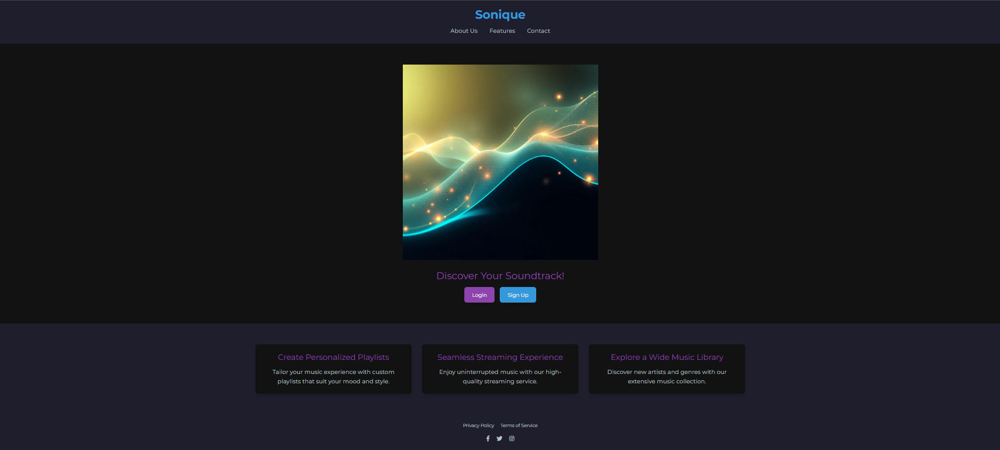
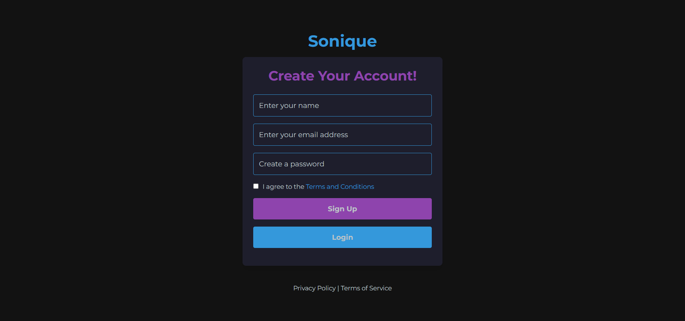
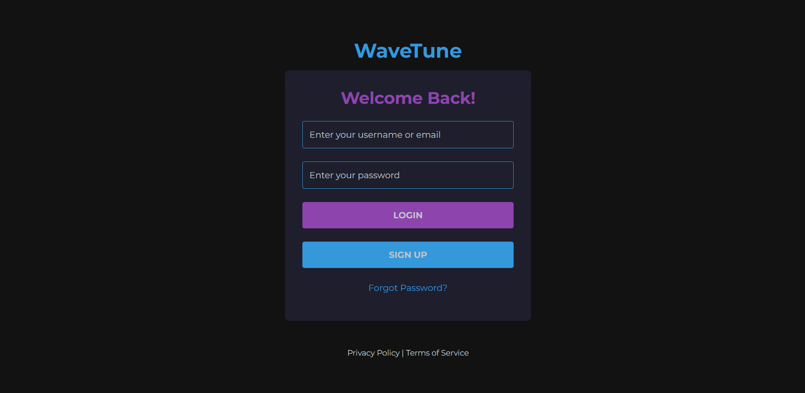
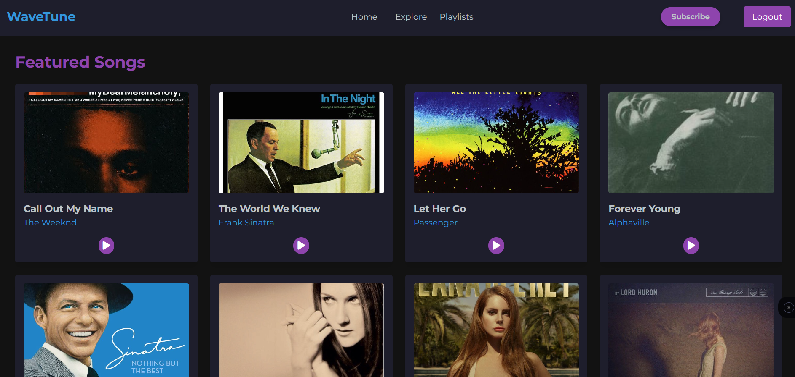
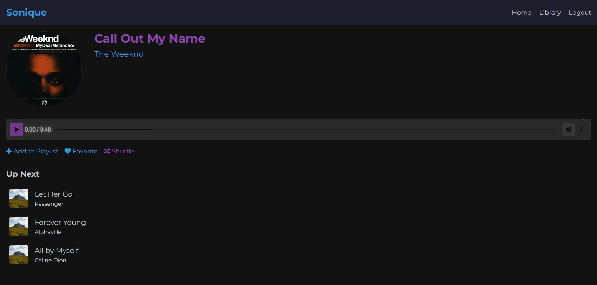
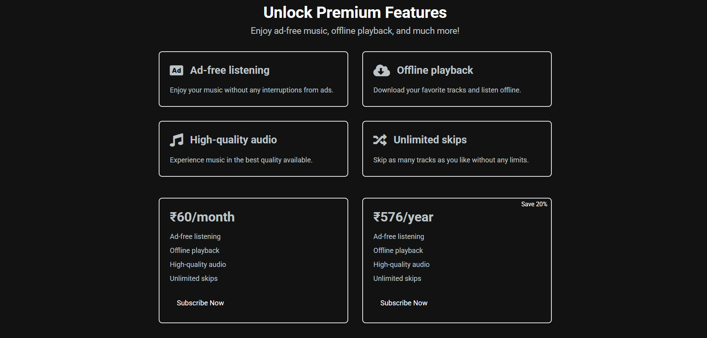
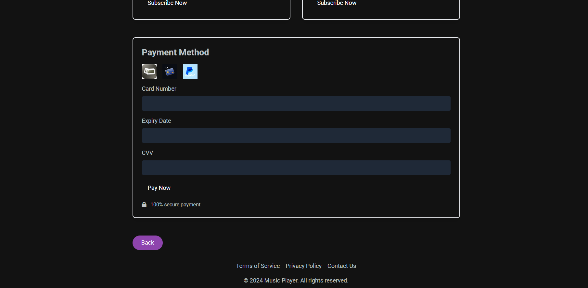

# 🎵 Sonique – Music Player Website

Sonique is a stylish and lightweight music player built with **EJS** and **JavaScript**. This project aims to provide a clean, functional audio player for web users with interactive UI elements and modern features.

---

## 📸 Screenshots

> Screenshots from the app UI

  
*Landingpage showcasing trending tracks and genres*

  
*Signup page for new users*

  
*Login page with user authentication UI*

  
*Main music player interface*

  
*Detailed song view with lyrics and controls*

  
*Subscription plans overview*

  
*Payment confirmation and plan details*

---

## ✨ Features

- 🎧 **Play, Pause, Next, Previous**
- 🕒 **Real-time seekable progress bar**
- 🔊 **Volume control with mute/unmute**
- 🔁 **Loop and Shuffle functionality**
- 📀 **Track info with title, artist, and album cover**
- 💾 **Remembers your last played track (using `localStorage`)**

---

## 🧰 Technologies Used

| Tech         | Description                          |
|--------------|--------------------------------------|
| HTML5        | Semantic markup for structure        |
| CSS3         | Responsive layout & animations       |
| JavaScript   | Core interactivity                   |
| localStorage | Save user preferences/session        |
| EJS          | Templating engine for dynamic HTML   |
| Express.js   | Backend framework for routing & APIs |

---

## 💡 Future Enhancements

- 🎙️ Voice-controlled commands
- 📦 Playlist management
- 🎵 Integration with Spotify or other APIs
- 🌓 Dark mode toggle

---

## 📬 Contact

Created by [Tanmay Sachan]  
📧 Email: tanmaysachan0005@gmail.com  
🌐 GitHub: [@tanmayyysachan](https://github.com/tanmayyysachan)

---

> Built with ❤️ to make your music experience smoother.
